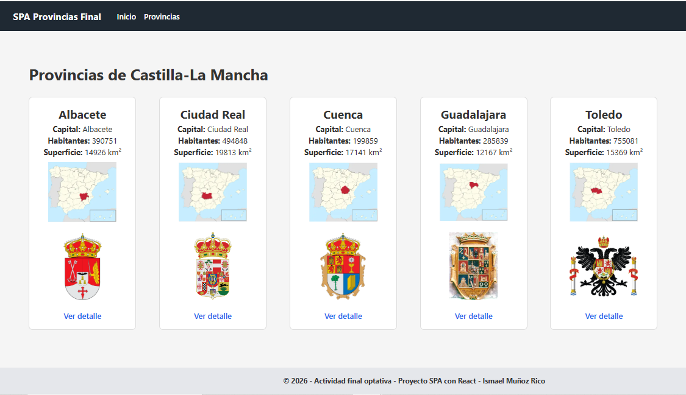
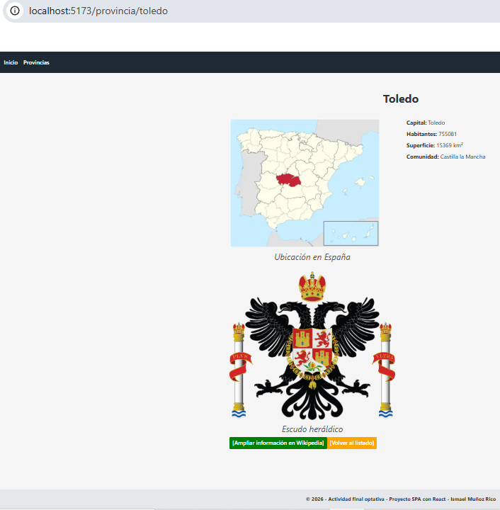
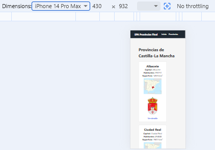

# SPA Provincias de Castilla-La Mancha

> Aplicación Full-Stack desarrollada con React, Node.js, Express y MySQL que permite consultar información de las provincias de Castilla-La Mancha mediante una API REST propia.

---

## 📖 Descripción del proyecto

Este proyecto consiste en una Single Page Application (SPA) desarrollada como práctica de desarrollo Full-Stack, con el objetivo de aplicar una arquitectura moderna basada en la separación entre frontend y backend, así como poner en práctica el consumo de una API REST propia.

El frontend, desarrollado con React y Vite, ofrece una interfaz dinámica e intuitiva que permite navegar entre las distintas provincias de Castilla-La Mancha sin necesidad de recargar la página. La aplicación consume una API REST implementada con Node.js y Express, responsable de gestionar las peticiones y proporcionar la información solicitada por el cliente.

Los datos se almacenan en una base de datos MySQL, utilizando Sequelize como ORM para facilitar el acceso y la gestión de la información de forma estructurada y mantenible.

La aplicación permite consultar información de las cinco provincias de Castilla-La Mancha, mostrando datos como la capital, la población, la superficie, así como mapas y escudos representativos de cada provincia.

Más allá de la funcionalidad implementada, este proyecto me ha servido para consolidar mis conocimientos sobre el desarrollo de aplicaciones Full-Stack, el diseño de APIs REST, la organización modular del código, el uso de React Router para la navegación, la gestión de peticiones HTTP mediante Axios, la realización de pruebas con Postman y la utilización de Git y GitHub como herramientas de control de versiones y documentación del proyecto.

---

## 📸 Vista previa de la aplicación

La página principal muestra las cinco provincias de Castilla-La Mancha mediante tarjetas informativas. Desde cada una de ellas es posible acceder a la vista de detalle, donde se puede consultar información adicional mediante un enlace a la Wikipedia, se presenta el mapa y el escudo heráldico ampliado, representativo de la provincia.



---

## 🏗️ Arquitectura de la aplicación

La aplicación sigue una arquitectura **Full-Stack** basada en la separación de responsabilidades entre el cliente (frontend), el servidor (backend) y la base de datos.

```text
                 Usuario
                     │
                     ▼
        ┌─────────────────────┐
        │ React + Vite (SPA)  │
        │ Frontend            │
        └─────────────────────┘
                     │
             Peticiones HTTP
                 (Axios)
                     │
                     ▼
        ┌─────────────────────┐
        │ Node.js + Express   │
        │ API REST            │
        └─────────────────────┘
                     │
                Sequelize ORM
                     │
                     ▼
        ┌─────────────────────┐
        │ MySQL               │
        │ Base de datos       │
        └─────────────────────┘
```

### Separación entre frontend y backend

El proyecto se ha diseñado separando claramente el **frontend** del **backend**, una práctica habitual en el desarrollo de aplicaciones modernas.

El frontend es responsable de la interfaz de usuario y de la experiencia de navegación, mientras que el backend centraliza la lógica de negocio, el acceso a los datos y la gestión de las peticiones realizadas por la aplicación.

Esta separación facilita el mantenimiento del código, permite desarrollar ambos módulos de forma independiente y favorece la escalabilidad del proyecto.

### ¿Por qué utilizar una API REST?

En lugar de permitir que el frontend acceda directamente a la base de datos, la comunicación se realiza mediante una **API REST** desarrollada con Express.

Este enfoque aporta varias ventajas:

- Protege la base de datos evitando accesos directos desde el cliente.
- Centraliza la lógica de negocio en un único punto.
- Facilita la validación y el tratamiento de los datos antes de enviarlos al frontend.
- Permite que otros clientes (por ejemplo, una aplicación móvil) puedan reutilizar la misma API en el futuro.

En este proyecto, el frontend consume los endpoints de la API mediante Axios para obtener la lista de provincias y consultar la información detallada de cada una de ellas. De esta forma, la interfaz de usuario permanece desacoplada de la base de datos y toda la comunicación se realiza a través del servidor.

### ¿Por qué Sequelize?

Para el acceso a la base de datos se ha utilizado **Sequelize**, un ORM (*Object-Relational Mapping*) para Node.js.

Sequelize permite trabajar con modelos de JavaScript en lugar de escribir consultas SQL para las operaciones habituales, lo que hace que el código sea más legible, mantenible y portable.

Además, facilita tareas como la definición de modelos, las relaciones entre entidades y la sincronización con la base de datos, reduciendo la posibilidad de errores y mejorando la organización del proyecto.

---

## ✨ Funcionalidades

La aplicación permite consultar de forma sencilla la información de las provincias de Castilla-La Mancha mediante una interfaz moderna desarrollada como Single Page Application (SPA).

Entre sus principales funcionalidades destacan:

- **Visualización del listado de provincias**, presentado mediante tarjetas con información resumida.
- **Consulta del detalle de cada provincia**, mostrando datos como la capital, la población, la superficie, el mapa geográfico, el escudo heráldico representativo y enlace para ampliar información en Wikipedia.
- **Navegación fluida entre vistas** mediante React Router, evitando recargas completas de la página.
- **Obtención dinámica de los datos** a través de una API REST desarrollada con Node.js y Express.
- **Presentación responsive**, adaptando la interfaz a diferentes tamaños de pantalla para mejorar la experiencia de usuario.

---

## 🛠️ Tecnologías utilizadas

Las tecnologías empleadas en este proyecto se presentan agrupadas según la capa de la aplicación en la que intervienen. Esta organización permite comprender de forma rápida la arquitectura del proyecto y el papel que desempeña cada herramienta dentro del desarrollo.

### Frontend

| Tecnología | Descripción |
|------------|-------------|
| **JavaScript (ES6+)** | Lenguaje de programación utilizado para desarrollar la lógica de la aplicación en el frontend y el backend. |
| **HTML5** | Lenguaje de marcado empleado para estructurar las páginas de la aplicación. |
| **CSS3** | Lenguaje de estilos utilizado para el diseño y la presentación visual de la interfaz. |
| **React** | Biblioteca JavaScript utilizada para construir la interfaz de usuario mediante componentes reutilizables. |
| **Vite** | Herramienta de desarrollo y empaquetado que proporciona un entorno rápido y optimizado para aplicaciones React. |
| **React Router** | Biblioteca utilizada para gestionar la navegación entre las distintas vistas de la SPA sin recargar la página. |
| **Axios** | Cliente HTTP utilizado para consumir la API REST desde el frontend. |
| **CSS Modules** | Sistema de estilos modulares que evita conflictos entre clases CSS y mejora el mantenimiento del código. |

### Backend

| Tecnología | Descripción |
|------------|-------------|
| **Node.js** | Entorno de ejecución que permite desarrollar el servidor utilizando JavaScript. |
| **Express** | Framework utilizado para crear la API REST y gestionar las peticiones HTTP. |
| **Sequelize** | ORM (*Object-Relational Mapping*) que facilita el acceso a la base de datos mediante modelos de JavaScript. |
| **MySQL** | Sistema gestor de bases de datos relacional donde se almacena la información de las provincias. |

### Herramientas

| Herramienta | Descripción |
|-------------|-------------|
| **Git** | Sistema de control de versiones utilizado para gestionar el historial del proyecto. |
| **GitHub** | Plataforma empleada para alojar el repositorio y facilitar la colaboración y el seguimiento del desarrollo. |
| **Visual Studio Code** | Editor de código utilizado durante el desarrollo de la aplicación. |
| **Postman** | Herramienta utilizada para probar y verificar los endpoints de la API REST. |
| **pnpm** | Gestor de paquetes empleado para instalar y administrar las dependencias del proyecto. |
| **XAMPP** | Entorno local utilizado para ejecutar el servidor MySQL durante el desarrollo. |

---

### 📋 Resumen del stack tecnológico

| Capa | Tecnologías |
|------|-------------|
| **Frontend** | JavaScript (ES6+) · HTML5 · CSS3 · React · Vite · React Router · Axios · CSS Modules |
| **Backend** | Node.js · Express · Sequelize · MySQL |
| **Herramientas** | Git · GitHub · Visual Studio Code · Postman · pnpm · XAMPP |

<p align="center">
  
</p>

## 📁 Estructura del proyecto

El proyecto se organiza siguiendo una arquitectura **Full-Stack**, separando claramente el frontend y el backend en directorios independientes. Esta organización facilita el mantenimiento, la escalabilidad y la comprensión del código, permitiendo desarrollar cada parte de la aplicación de forma desacoplada.

```text
spa-provincias-final/
│
├── backend/
│   ├── src/
│   │   ├── config/
│   │   │   └── database.js
│   │   ├── controllers/
│   │   │   └── provincias.controller.js
│   │   ├── models/
│   │   │   └── provincia.js
│   │   ├── routes/
│   │   │   └── provincias.routes.js
│   │   ├── seed/
│   │   │   ├── index.js
│   │   │   └── provincias.seed.js
│   │   └── index.js
│   ├── package.json
│   └── pnpm-lock.yaml
│
├── docs/
│   └── images/
│
├── frontend/
│   ├── public/
│   │   ├── favicon-spain.svg
│   │   └── img/
│   │       ├── escudos/
│   │       └── mapas/
│   │
│   ├── src/
│   │   ├── api/
│   │   ├── components/
│   │   ├── pages/
│   │   ├── router/
│   │   ├── utils/
│   │   ├── App.jsx
│   │   ├── main.jsx
│   │   └── index.css
│   │
│   ├── .env.example
│   ├── package.json
│   └── pnpm-lock.yaml
│
├── .gitignore
├── README.md
├── eslint.config.js
├── pnpm-lock.yaml
└── vite.config.js
```

### Organización del backend

El backend concentra la lógica de negocio y el acceso a los datos. Se estructura siguiendo una organización modular basada en responsabilidades:

- **config/**: configuración de la conexión con la base de datos.
- **controllers/**: implementación de la lógica que procesa las peticiones HTTP.
- **models/**: definición de los modelos de datos mediante Sequelize.
- **routes/**: definición de los endpoints de la API REST.
- **seed/**: carga inicial de datos para la base de datos.
- **index.js**: punto de entrada del servidor Express.

### Organización del frontend

La organización del frontend sigue una estructura basada en responsabilidades, donde cada directorio agrupa archivos con una finalidad específica. Este enfoque favorece la reutilización de componentes, mejora la mantenibilidad del código y facilita la incorporación de nuevas funcionalidades conforme el proyecto evoluciona.

Esta estructura modular es propia de aplicaciones React:

- **api/**: funciones encargadas de comunicarse con la API REST.
- **components/**: componentes reutilizables de la interfaz de usuario.
- **pages/**: páginas principales de la aplicación.
- **router/**: configuración de React Router y definición de las rutas.
- **utils/**: funciones auxiliares reutilizables.
- **public/**: recursos estáticos como imágenes, mapas y escudos.

### Documentación

El directorio **docs/** almacena los recursos utilizados en la documentación del proyecto, como las capturas de pantalla y otros elementos gráficos empleados en este README.

Esta separación evita mezclar los recursos de la documentación con los archivos propios de la aplicación.

---

## ⚙️ Instalación

El proyecto está dividido en dos aplicaciones independientes: un frontend desarrollado con React y un backend desarrollado con Node.js y Express. Por este motivo, las dependencias deben instalarse por separado en cada uno de los directorios.

Sigue los siguientes pasos para ejecutar el proyecto en un entorno de desarrollo local.

### 1. Clonar el repositorio

```bash
git clone https://github.com/Imunric/spa-provincias-final.git
cd spa-provincias-final
```

### 2. Instalar las dependencias del backend

```bash
cd backend
pnpm install
```

### 3. Instalar las dependencias del frontend

```bash
cd ../frontend
pnpm install
```

Una vez completados estos pasos, estarán instaladas todas las dependencias necesarias para ejecutar la aplicación tanto en el frontend como en el backend.

> **Nota:** Este proyecto utiliza **pnpm** como gestor de paquetes. Si no lo tienes instalado, puedes hacerlo previamente con:

```bash
npm install -g pnpm
```
### Requisitos

Para el desarrollo de este proyecto se han utilizado las siguientes versiones:

- Node.js 22.x
- pnpm 10.x
- MySQL 8.x
- Git 2.x

---

## 🔧 Configuración

Una vez instaladas las dependencias, es necesario realizar una serie de configuraciones para que el frontend pueda comunicarse correctamente con el backend y este, a su vez, con la base de datos.

### 1. Configurar la base de datos

Asegúrate de tener un servidor MySQL en funcionamiento y crea una base de datos denominada:

```sql
CREATE DATABASE provinciasdb;
```

### 2. Configurar la conexión del backend

Revisa el archivo:

```text
backend/src/config/database.js
```

y verifica que los parámetros de conexión coinciden con tu instalación de MySQL:

- Host
- Puerto
- Usuario
- Contraseña
- Nombre de la base de datos

Por ejemplo:

```javascript
database: 'provinciasdb',
username: 'root',
password: '',
host: 'localhost',
port: 3307
```

> **Nota:** En este proyecto se utiliza el puerto **3307**, ya que durante el desarrollo se configuró MySQL en XAMPP para evitar conflictos con otras instalaciones locales.

### 3. Cargar los datos iniciales

El proyecto incluye un script de inicialización (seed) que inserta automáticamente la información de las cinco provincias de Castilla-La Mancha. Esto evita tener que introducir los datos manualmente y garantiza que todos los desarrolladores trabajen con el mismo conjunto de datos desde el primer momento.

Con la base de datos creada, ejecuta el script de inicialización para cargar la información de las provincias:

```bash
cd backend
pnpm run seed
```

Este proceso creará los registros iniciales necesarios para el funcionamiento de la aplicación.

### 4. Configurar las variables de entorno del frontend

Dentro del directorio `frontend` encontrarás el archivo:

```text
.env.example
```

Crea una copia denominada:

```text
.env
```

y verifica que contiene la configuración adecuada:

```env
VITE_API_BASE_URL=http://localhost:3000
VITE_IMAGES_BASE_URL=/
```

Estas variables indican la dirección del servidor backend y la ruta utilizada para acceder a los recursos estáticos desde el frontend.

### 5. Comprobar la configuración

Antes de ejecutar la aplicación, verifica que:

- El servidor MySQL está en funcionamiento.
- La base de datos `provinciasdb` existe.
- Los datos iniciales han sido cargados correctamente.
- El archivo `.env` está configurado.
- El backend podrá iniciarse en el puerto **3000**.

---

## ▶️ Ejecución del proyecto

Una vez completada la instalación y la configuración, inicia por separado el backend y el frontend.

### 1. Iniciar el backend

Abre una terminal y ejecuta:

```bash
cd backend
pnpm run start
```

Si todo es correcto, la consola mostrará un resultado similar al siguiente:

```text
Base de datos conectada y sincronizada
Servidor escuchando en http://localhost:3000
```

Estos mensajes indican que:

- La conexión con MySQL se ha establecido correctamente.
- Sequelize ha sincronizado los modelos con la base de datos.
- El servidor Express está en funcionamiento y preparado para recibir peticiones.

---

### 2. Iniciar el frontend

Abre una segunda terminal y ejecuta:

```bash
cd frontend
pnpm run dev
```

La consola mostrará un mensaje similar a:

```text
VITE v7.x.x ready in XXX ms

➜  Local:   http://localhost:5173/
```

Esto indica que el servidor de desarrollo de Vite está funcionando correctamente.

---

### 3. Acceder a la aplicación

Abre el navegador y accede a:

```text
http://localhost:5173
```

---

### ✔️ Verificación rápida

Si la instalación y la configuración se han realizado correctamente, deberías comprobar que:

- El backend muestra los mensajes:
  - `Base de datos conectada y sincronizada`
  - `Servidor escuchando en http://localhost:3000`
- El frontend se inicia sin errores y Vite indica la dirección local de la aplicación.
- La página principal muestra las cinco provincias de Castilla-La Mancha.
- Al seleccionar una provincia se accede correctamente a la vista de detalle.
- La información se obtiene correctamente desde la API REST.

---

## 🌐 API REST

El backend expone una **API REST** desarrollada con **Node.js**, **Express** y **Sequelize**, encargada de gestionar la información de las provincias de Castilla-La Mancha y suministrarla al frontend desarrollado con React.

Una vez iniciado el servidor, la API estará disponible en:

```text
http://localhost:3000
```

### Comprobación inicial

La ruta principal permite comprobar rápidamente que el servidor Express está funcionando correctamente.

**Petición**

```http
GET http://localhost:3000/
```

**Respuesta esperada**

```text
API de provincias de España
```

---

### Endpoints disponibles

| Método | Endpoint | Descripción |
|---------|----------|-------------|
| **GET** | `/provincias` | Obtiene el listado completo de provincias. |
| **GET** | `/provincias/:slug` | Obtiene la información de una provincia mediante su *slug*. |
| **POST** | `/provincias` | Crea una nueva provincia. |
| **PUT** | `/provincias/:slug` | Actualiza una provincia existente. |
| **DELETE** | `/provincias/:slug` | Elimina una provincia. |

> **Nota:** Aunque el frontend únicamente utiliza los endpoints de consulta (`GET`), el backend implementa las operaciones básicas de un **CRUD** (Create, Read, Update y Delete), permitiendo ampliar fácilmente la aplicación en futuras versiones.

---

### ¿Qué es un *slug*?

Cada provincia dispone de un identificador textual único (*slug*), utilizado para construir URLs más descriptivas y fáciles de interpretar.

Ejemplos:

```text
/provincias/albacete
/provincias/ciudad-real
/provincias/cuenca
/provincias/guadalajara
/provincias/toledo
```

El uso de *slugs* mejora la legibilidad de las rutas y constituye una práctica habitual en el diseño de APIs REST, evitando depender exclusivamente de identificadores numéricos.

---

### Modelo de datos

Cada provincia almacenada en la base de datos contiene la siguiente información:

| Campo | Tipo | Descripción |
|--------|------|-------------|
| `id` | Integer | Identificador interno de la provincia. |
| `nombre` | String | Nombre de la provincia. |
| `slug` | String | Identificador único utilizado en las URLs de la API. |
| `comunidad` | String | Comunidad autónoma a la que pertenece la provincia. |
| `capital` | String | Capital de la provincia. |
| `habitantes` | Integer | Número de habitantes. |
| `superficie` | Integer | Superficie en kilómetros cuadrados. |
| `imagen_mapa` | String | Nombre del archivo de la imagen del mapa provincial. |
| `imagen_escudo` | String | Nombre del archivo de la imagen del escudo provincial. |

---

### Ejemplo de respuesta JSON

Una petición realizada al endpoint:

```http
GET http://localhost:3000/provincias/albacete
```

devolverá un objeto JSON con una estructura similar a la siguiente:

```json
{
  "id":1,
  "nombre":"Albacete",
  "slug":"albacete",
  "comunidad":"Castilla la Mancha",
  "capital":"Albacete",
  "habitantes":390751,
  "superficie":14926,
  "imagen_mapa":"img/mapas/Albacete.webp",
  "imagen_escudo":"img/escudos/Escudo_provincia_Albacete.webp"
}

```
---

### Consumo de la API desde el frontend

El frontend utiliza **Axios** para comunicarse con la API REST. La configuración del cliente HTTP se centraliza en un único archivo (`provinciasApi.js`), cuya URL base se obtiene mediante variables de entorno.

```javascript
baseURL: `${import.meta.env.VITE_API_BASE_URL}/provincias`
```

Actualmente el frontend consume los siguientes endpoints:

| Función | Método HTTP | Endpoint |
|---------|-------------|----------|
| Obtener todas las provincias | **GET** | `/provincias` |
| Obtener una provincia por su *slug* | **GET** | `/provincias/:slug` |

Esta arquitectura desacopla completamente el frontend del backend, permitiendo desarrollar, mantener y desplegar ambos servicios de forma independiente.

---

### Códigos de respuesta HTTP

| Código | Significado |
|---------|-------------|
| **200 OK** | La petición se ha procesado correctamente. |
| **201 Created** | El recurso se ha creado correctamente. |
| **404 Not Found** | La provincia solicitada no existe. |
| **500 Internal Server Error** | Se ha producido un error interno en el servidor. |

---

### Comprobación desde el navegador

Con el servidor en funcionamiento, es posible verificar el correcto funcionamiento de la API accediendo a las siguientes direcciones:

| URL | Resultado esperado |
|-----|--------------------|
| `http://localhost:3000/` | Muestra el mensaje `API de provincias de España`. |
| `http://localhost:3000/provincias` | Devuelve el listado completo de provincias en formato JSON. |
| `http://localhost:3000/provincias/albacete` | Devuelve la información de la provincia de Albacete en formato JSON. |

---

### Comprobación con Postman

La API también puede probarse mediante Postman utilizando los mismos endpoints.

#### Obtener todas las provincias

```http
GET http://localhost:3000/provincias
```

#### Obtener una provincia

```http
GET http://localhost:3000/provincias/albacete
```

---

### Flujo de una petición

```text
Usuario
    │
    ▼
React Router
(/provincia/albacete)
    │
    ▼
ProvinciaDetail.jsx
    │
    ▼
getProvinciaBySlug()
    │
    ▼
Axios
(baseURL = VITE_API_BASE_URL/provincias)
    │
GET /provincias/albacete
    │
    ▼
Express Router
    │
    ▼
provincias.controller.js
    │
    ▼
Modelo Provincia (Sequelize)
    │
    ▼
MySQL
    │
Respuesta JSON
    │
    ▼
React renderiza la información
```

---

### Verificación rápida

La API funciona correctamente cuando:

- El backend muestra los mensajes:

```text
Base de datos conectada y sincronizada
Servidor escuchando en http://localhost:3000
```

- La ruta `http://localhost:3000/` responde con el mensaje:

```text
API de provincias de España
```

- La ruta `http://localhost:3000/provincias` devuelve un listado de provincias en formato JSON.
- La ruta `http://localhost:3000/provincias/albacete` devuelve correctamente la información de la provincia solicitada.
- El frontend muestra la información de las provincias consumiendo los datos desde la API sin errores.

---

## 📷 Capturas de pantalla

### Vista de detalle

Cada provincia dispone de una página propia donde se muestra información detallada obtenida dinámicamente desde la API REST.



---

### Diseño responsive

La interfaz se adapta automáticamente a distintos tamaños de pantalla, garantizando una experiencia de usuario adecuada tanto en equipos de escritorio como en dispositivos móviles.



---

## 📚 Lo que he aprendido

Este proyecto me ha permitido consolidar conocimientos de desarrollo **Full-Stack** mediante la construcción de una aplicación completa, desde el diseño de la interfaz hasta la gestión de los datos.

Durante su desarrollo he aprendido a:

- Diseñar una arquitectura separando el **frontend** y el **backend** mediante una API REST.
- Consumir servicios web desde React utilizando **Axios** y gestionar la navegación con **React Router**.
- Desarrollar una API con **Node.js**, **Express** y **Sequelize**, conectándola a una base de datos **MySQL**.
- Diseñar rutas más descriptivas utilizando **slugs** en lugar de identificadores numéricos.
- Organizar un proyecto siguiendo una estructura modular y fácil de mantener.
- Utilizar **Git** y **GitHub** para el control de versiones, documentando el proyecto mediante un README profesional.

Además del aprendizaje técnico, este proyecto me ha permitido entender mejor el flujo completo de una aplicación web moderna, desde la petición realizada por el usuario hasta la obtención y presentación de los datos almacenados en la base de datos. Esto supone para mi, un paso importante en mi transición desde el desarrollo frontend hacia el desarrollo Full-Stack, permitiéndome comprender mejor cómo interactúan todas las capas que componen una aplicación web moderna.

---

## 🚀 Mejoras futuras

Este proyecto ha sido desarrollado como trabajo final de una formación en Desarrollo Web y cumple los objetivos funcionales y técnicos planteados. No obstante, como ocurre en cualquier proyecto de software, existen numerosas posibilidades de evolución y mejora.

Entre las posibles líneas de desarrollo futuras podría destacar:

- Implementar autenticación y autorización de usuarios para diferenciar distintos niveles de acceso.
- Incorporar validación de datos tanto en el frontend como en el backend para mejorar la robustez de la aplicación.
- Añadir funcionalidades de búsqueda, filtrado y ordenación de provincias.
- Añadir contenido y escalar la aplicación a todas las provincias de España.
- Mejorar el tratamiento de errores y la experiencia de usuario mediante mensajes más descriptivos y estados de carga avanzados.
- Desarrollar una batería de pruebas unitarias y de integración para aumentar la fiabilidad del código.
- Documentar la API mediante herramientas como OpenAPI (Swagger).
- Preparar el proyecto para su despliegue en un entorno de producción utilizando servicios en la nube y un sistema de integración y despliegue continuo (CI/CD).
- Optimizar el rendimiento y la accesibilidad siguiendo las recomendaciones de Lighthouse de Google y las pautas WCAG (Web Content Accessibility Guidelines).

Más allá de estas mejoras concretas, este proyecto representa una base sobre la que continuar aprendiendo, aplicando nuevas tecnologías y buenas prácticas de desarrollo, tanto para ampliar este proyecto o realizar otros proyectos futuros, como ir incorporando funcionalidades y refinando sus arquitecturas a medida que adquiera nuevos conocimientos y experiencia.

---

## 👨‍💻 Autor

**Ismael Muñoz Rico**

Proyecto desarrollado como práctica de desarrollo Full-Stack utilizando React, Node.js, Express y MySQL.